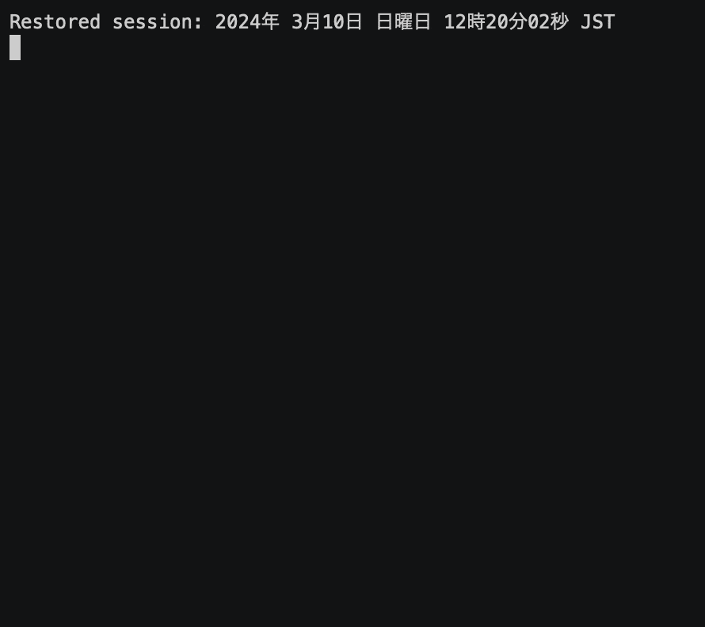

# Bitflyer API from OCaml

## Example of use

## API実装状況

[公式APIドキュメント](https://lightning.bitflyer.com/docs)に基づく実装状況一覧です。

### HTTP Public API

| API | エンドポイント | 状態 | 実装 |
|---|---|---|---|
| マーケットの一覧 | `GET /v1/getmarkets`, `/v1/markets` | ✅ | `PublicApi.getmarkets`, `PublicApi.markets` |
| 板情報 | `GET /v1/getboard`, `/v1/board` | ✅ | `PublicApi.getboard`, `PublicApi.board` |
| Ticker | `GET /v1/getticker`, `/v1/ticker` | ✅ | `PublicApi.getticker`, `PublicApi.ticker` |
| 約定履歴 | `GET /v1/getexecutions`, `/v1/executions` | ✅ | `PublicApi.getexecutions`, `PublicApi.executions` |
| 板の状態 | `GET /v1/getboardstate` | ✅ | `PublicApi.getboardstate` |
| 取引所の状態 | `GET /v1/gethealth` | ✅ | `PublicApi.gethealth` |
| ファンディングレート | `GET /v1/getfundingrate` | ❌ | - |
| ファンディングレート履歴 | `GET /v1/getfundingratehistory` | ❌ | - |
| 法人アカウント最大レバレッジ | `GET /v1/getcorporateleverage` | ❌ | - |
| チャット | `GET /v1/getchats` | ✅ | `PublicApi.getchats` |

### HTTP Private API — API

| API | エンドポイント | 状態 | 実装 |
|---|---|---|---|
| APIキーの権限を取得 | `GET /v1/me/getpermissions` | ❌ | - |

### HTTP Private API — 資産

| API | エンドポイント | 状態 | 実装 |
|---|---|---|---|
| 資産残高を取得 | `GET /v1/me/getbalance` | ✅ | `PrivateApi.getbalance` |
| 証拠金の状態を取得 | `GET /v1/me/getcollateral` | ⚠️ | `Assets.getcollateral`（`PrivateApi`未公開・戻り値が生JSON） |
| 証拠金の数量（通貨別）を取得 | `GET /v1/me/getcollateralaccounts` | ⚠️ | `Assets.getcollateralaccount`（`PrivateApi`未公開・戻り値が生JSON） |

### HTTP Private API — 入出金

| API | エンドポイント | 状態 | 実装 |
|---|---|---|---|
| 預入用アドレス取得 | `GET /v1/me/getaddresses` | ✅ | `PrivateApi.getaddresses` |
| 仮想通貨預入履歴 | `GET /v1/me/getcoinins` | ❌ | - |
| 仮想通貨送付履歴 | `GET /v1/me/getcoinouts` | ❌ | - |
| 銀行口座一覧取得 | `GET /v1/me/getbankaccounts` | ❌ | - |
| 入金履歴 | `GET /v1/me/getdeposits` | ❌ | - |
| 出金 | `POST /v1/me/withdraw` | ❌ | - |
| 出金履歴 | `GET /v1/me/getwithdrawals` | ❌ | - |

### HTTP Private API — トレード

| API | エンドポイント | 状態 | 実装 |
|---|---|---|---|
| 新規注文を出す | `POST /v1/me/sendchildorder` | ✅ | `PrivateApi.sendchildorder` |
| 注文をキャンセルする | `POST /v1/me/cancelchildorder` | ✅ | `PrivateApi.cancelchildorder` |
| 新規の親注文を出す（特殊注文） | `POST /v1/me/sendparentorder` | ✅ | `PrivateApi.sendparentorder` |
| 親注文をキャンセルする | `POST /v1/me/cancelparentorder` | ✅ | `PrivateApi.cancelparentorder` |
| すべての注文をキャンセルする | `POST /v1/me/cancelallchildorders` | ✅ | `PrivateApi.cancelallchildorders` |
| 注文の一覧を取得 | `GET /v1/me/getchildorders` | ✅ | `PrivateApi.getchildorders` |
| 親注文の一覧を取得 | `GET /v1/me/getparentorders` | ✅ | `PrivateApi.getparentorders` |
| 親注文の詳細を取得 | `GET /v1/me/getparentorder` | ✅ | `PrivateApi.getparentorder` |
| 約定の一覧を取得 | `GET /v1/me/getexecutions` | ✅ | `PrivateApi.getexecutions` |
| 残高履歴を取得 | `GET /v1/me/getbalancehistory` | ❌ | - |
| 建玉の一覧を取得 | `GET /v1/me/getpositions` | ✅ | `PrivateApi.getpositions`（信用（FX_BTC_JPY）取引のポジション確認に使用） |
| 証拠金の変動履歴を取得 | `GET /v1/me/getcollateralhistory` | ❌ | - |
| 取引手数料を取得 | `GET /v1/me/gettradingcommission` | ✅ | `PrivateApi.gettradingcommission`（`commision`誤記を修正済み） |

### Realtime API (WebSocket)

| チャンネル | 状態 | 実装 |
|---|---|---|
| Ticker (`lightning_ticker_<product_code>`) | ✅ | `Realtime.updates`（`Ticker of PublicApi.ticker`） |
| 板情報 (`lightning_board_snapshot_<product_code>`, `lightning_board_<product_code>`) | ✅ | `Realtime.updates`（`Board of Realtime.orderbook`。差分を内部で積算し常に最新の板状態を返す） |
| 約定 (`lightning_executions_<product_code>`) | ❌ | - |
| チャイルドオーダー・親注文イベント (`child_order_events`, `parent_order_events`) | ❌ | - |

既知の制約:
- 接続を明示的に閉じる手段は未実装（ストリームの消費をやめても裏の接続は残る）
- 発注条件を満たす間は毎回発注する仕様（連続発注の抑制なし）

## レートリミッター

[API制限](https://lightning.bitflyer.com/docs)に基づき、`ApiCommon`が全てのHTTPリクエストに自動で流量制限をかけます（`RateLimiter`モジュール、スライディングウィンドウ方式）。上限に達した場合は例外を投げずに、枠が空くまで自動的に待機してから送信します。

| 対象 | 上限 | 適用範囲 |
|---|---|---|
| 全リクエスト共通 | 500回 / 5分 | `ApiCommon.get_public`, `get`, `post` すべて |
| 注文系エンドポイント | 300回 / 5分 | `sendchildorder`, `sendparentorder`, `cancelallchildorders` |

「数量0.1以下の注文は1分間で100回まで」という注文内容に依存する制限は、注文サイズを解釈する必要があるため未対応です。
